# Student-Grading-System

## Project UML Diagram

```mermaid
classDiagram
    class Student {
        -int id
        -String first_name
        -String last_name
        -String email
        +getId() int
        +setName(String name) bool
        +getName() String
        +generateEmail() String
        +getEmail() String
    }

    class StudentService {
        +addStudent(Student student) bool
        +removeStudent(Student student) bool
        +getCourses(Student student) List~Course~
        +getTotalCourses(Student student) int
        +displayDetails(Student student) String
        +calculateGPA(Student student) double
    }

    class Course {
        -int id
        -String course_code
        -String title
        -String instructor
        -int credit_hours
        -int total_students
        +setCourseCode(String id) bool
        +getCourseCode() String
        +setName(String name) bool
        +getName() String
        +setInstructor(String instructor) bool
        +getInstructor() String
        +setCreditHours(int hours) bool
        +getCreditHours() int
    }

    class CourseService {
        +addCourse(Course course) bool
        +removeCourse(Course course) bool
        +updateTotalStudents(int count) bool
        +getStudents() List~Student~
        +getTotalStudents() int
        +displayDetails() String
        +calculateTotalGrade(Student student) double
    }

    class GradeItem {
        -String title
        -String category
        -double score
        -double max_score
        -String feedback
        +setName(String name) bool
        +getName() String
        +setCategory(String category) bool
        +getCategory() String
        +setScore(double score, double max_score) bool
        +getScore() double
        +setFeedback(String feedback) bool
        +getFeedback() String
    }

    class GradeItemService {
        +addGradeItem(GradeItem item) bool
        +calculateWeight() double
        +calculatePercentage() double
        +contributionToTotal() double
    }

    class Enrollment {
        -int id
        -Student student
        -Course course
        -bool status
        +getId() int
        +getStudent() Student
        +getcourse() Course
    }

    class EnrollmentService {
        +enrollStudent(Student student, Course course) bool
        +dropCourse(Student student, Course course) bool
        +generateReportCard(Student student) String
    }
```



*Controller classes are not yet defined*

## Project Sequence Diagram

## Views

- Landing page
- Students view
- Courses view
- Grades view

## Classes

- Student, Student service, Student view controller

- Course, Course service, Course view controller

- Grade item, Grade Item service, Grade item view controller

- Enrollment, Enrollment service, Database Manager

---

### Student

- Attributes:
    * ID
    * Name
    * Email
    * Courses
- Methods:
    * Getters and setters

### Student Service

- Methods:
    * Display details
    * Calculate GPA
    * Generate report card

---

### Course

- Attributes:
    * ID
    * Name
    * Instructor
    * Credit hours
    * Number of students
- Methods:
    * Getters and setters

### Course Service

- Methods:
    * Display details
    * Calculate total grade

---

### Grade Item

- Attributes:
    * Name
    * Category
    * Grade
    * Feedback
- Methods:
    * Getters and setters

### Grade Item Service

- Methods:
    * Weight
    * Percentage
    * Contribution to total

---

### Database Manager

- Methods:
    * Fetch data
    * Create data
    * Update data
    * Delete data

---

# Project Code Standards

## Class Headers

Each class should have a header that contains:
1. The name of the class.
2. What the class represents.
3. Class methods overview.
5. The author of the module.

## Naming Conventions

7. Local Variables: Snake case or Flat case (i.e. `variable_name`, `variablename`)
8. Global Variables: Pascal snake case (i.e. `Global_Variable`)
9. Constants: Capital letters only (i.e. `CONSTANT`)
10. Functions: Camel case (i.e. `functionName`)
11. Classes: Pascal case (i.e. `ClassName`)

*Avoid including digits as much as possible.*

## Code Format

1. Indentation size: 2 space.
2. Braces: Open brace on the same line as the control statement.

## Documentation

### Class Documentation

```java
/**
 * @brief Represents <object>
 * @details Stores ...
 *          Links ...
 */
public class Class {
    // ...
}
```

### Method Documentation

```java
/**
 * @brief Adds two numbers.
 * @param a The first number.
 * @param b The second number.
 * @return The sum of the two numbers.
 * @throws IllegalArgumentException If one of the numbers is negative.
 */
public int addTwoNumbers(int a, int b) {
    // ...
}
```

### Field (Variable) Documentation

```java
private int integer; ///< A random integer.
private String test; ///< A test string.
```
